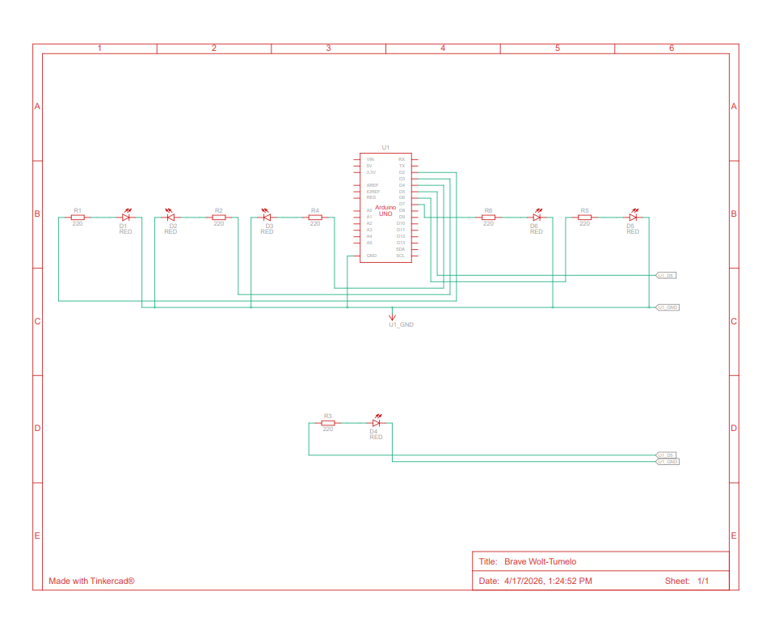

# 📘 Praktikum Sistem Tertanam — Modul 1: Perulangan

---

## 📝 Daftar Pertanyaan Praktikum

1. Gambarkan rangkaian skematik 5 LED running yang digunakan pada percobaan!
2. Jelaskan bagaimana program menghasilkan efek LED berjalan dari kiri ke kanan!
3. Jelaskan bagaimana program menghasilkan efek LED berjalan dari kanan ke kiri!
4. Buatlah program agar tiga LED sisi kanan dan tiga LED sisi kiri dapat menyala secara bergantian, lengkap dengan penjelasan setiap baris kodenya dalam format `README.md`!

---

## ✅ Jawaban

### 1. Skematik Rangkaian



---

### 2. Efek LED Bergerak dari Kiri ke Kanan

Efek pergerakan LED dari kiri menuju kanan diimplementasikan menggunakan struktur **perulangan `for`** yang mengakses pin-pin Arduino secara berurutan dari nomor kecil ke nomor besar.

#### 💻 Kode Program

```cpp
void loop() {
  // Perulangan dari pin kecil ke besar → efek kiri ke kanan
  for (int ledPin = 2; ledPin < 8; ledPin++) {
    digitalWrite(ledPin, HIGH); // Nyalakan LED pada pin aktif
    delay(100);                 // Tahan selama 100 ms
    digitalWrite(ledPin, LOW);  // Matikan LED sebelum pindah ke berikutnya
  }
}
```

#### 🔍 Penjelasan Kode

**1. Struktur Perulangan `for`**

```cpp
for (int ledPin = 2; ledPin < 8; ledPin++)
```

| Parameter    | Keterangan                                 |
| ------------ | ------------------------------------------ |
| `ledPin = 2` | Titik awal — LED paling kiri               |
| `ledPin < 8` | Batas akhir — berhenti setelah pin 7       |
| `ledPin++`   | Increment — bergeser satu langkah ke kanan |

Urutan eksekusi: **Pin 2 → 3 → 4 → 5 → 6 → 7**

**2. Menyalakan LED**

```cpp
digitalWrite(ledPin, HIGH);
```

Mengirimkan sinyal logika `HIGH` sehingga LED pada pin yang sedang aktif akan **menyala**.

**3. Jeda Waktu**

```cpp
delay(100);
```

Menghentikan eksekusi selama **100 milidetik** agar perpindahan antar-LED dapat terlihat oleh mata.

**4. Mematikan LED**

```cpp
digitalWrite(ledPin, LOW);
```

Mengirimkan sinyal logika `LOW` untuk **mematikan** LED sebelum program melanjutkan ke pin berikutnya.

#### 🔁 Mekanisme Efek Running

Karena proses nyala-jeda-mati berjalan sangat cepat secara berurutan, secara visual tampak seolah-olah **sebuah titik cahaya bergerak dari kiri ke kanan**.

#### 🖥️ Ilustrasi

```
[2] → [3] → [4] → [5] → [6] → [7]
⬤     ○     ○     ○     ○     ○
○     ⬤     ○     ○     ○     ○
○     ○     ⬤     ○     ○     ○
```

#### 📌 Ringkasan

Efek LED kiri ke kanan dihasilkan melalui kombinasi:

- Perulangan `for` dengan urutan pin **ascending** (kecil → besar)
- Pola `HIGH` → `delay` → `LOW` pada setiap pin

---

### 3. Efek LED Bergerak dari Kanan ke Kiri

Kebalikan dari sebelumnya, efek pergerakan dari kanan ke kiri dicapai dengan **membalik arah perulangan `for`**, yaitu dari nomor pin besar menuju nomor pin kecil.

#### 💻 Kode Program

```cpp
void loop() {
  // Perulangan dari pin besar ke kecil → efek kanan ke kiri
  for (int ledPin = 7; ledPin >= 2; ledPin--) {
    digitalWrite(ledPin, HIGH); // Nyalakan LED pada pin aktif
    delay(100);                 // Tahan selama 100 ms
    digitalWrite(ledPin, LOW);  // Matikan LED sebelum pindah ke berikutnya
  }
}
```

#### 🔍 Penjelasan Kode

**1. Perulangan `for` Terbalik**

```cpp
for (int ledPin = 7; ledPin >= 2; ledPin--)
```

| Parameter     | Keterangan                                |
| ------------- | ----------------------------------------- |
| `ledPin = 7`  | Titik awal — LED paling kanan             |
| `ledPin >= 2` | Batas akhir — berhenti di pin 2           |
| `ledPin--`    | Decrement — bergeser satu langkah ke kiri |

Urutan eksekusi: **Pin 7 → 6 → 5 → 4 → 3 → 2**

**2. Menyalakan LED**

```cpp
digitalWrite(ledPin, HIGH);
```

LED pada pin yang sedang aktif akan **menyala**.

**3. Jeda Waktu**

```cpp
delay(100);
```

Memberi jeda **100 ms** agar perpindahan LED dapat terlihat dengan jelas.

**4. Mematikan LED**

```cpp
digitalWrite(ledPin, LOW);
```

LED dimatikan sebelum eksekusi berpindah ke pin selanjutnya.

#### 🔁 Mekanisme Efek Running

Dengan urutan pin yang berjalan mundur, secara visual tampak seolah-olah **titik cahaya bergerak dari kanan menuju kiri**.

#### 🖥️ Ilustrasi

```
[7] ← [6] ← [5] ← [4] ← [3] ← [2]
⬤     ○     ○     ○     ○     ○
○     ⬤     ○     ○     ○     ○
○     ○     ⬤     ○     ○     ○
```

#### 📌 Ringkasan

Efek LED kanan ke kiri dihasilkan melalui kombinasi:

- Perulangan `for` dengan urutan pin **descending** (besar → kecil)
- Pola `HIGH` → `delay` → `LOW` pada setiap pin

---

### 4. Program Tiga LED Kiri & Kanan Bergantian

Program ini dirancang untuk menghasilkan pola berikut:

- **3 LED sisi kiri** (pin 2, 3, 4) menyala secara bersamaan
- **3 LED sisi kanan** (pin 5, 6, 7) menyala secara bersamaan
- Kedua kelompok **bertukar nyala** secara bergantian dan terus-menerus

#### 💻 Kode Program

```cpp
// Variabel penentu durasi jeda antar pola
int timer = 500;

void setup() {
  // Inisialisasi pin 2 hingga 7 sebagai jalur keluaran (OUTPUT)
  for (int ledPin = 2; ledPin < 8; ledPin++) {
    pinMode(ledPin, OUTPUT);
  }
}

void loop() {

  // === POLA 1: Tiga LED Kiri Aktif ===
  digitalWrite(2, HIGH);   // LED pin 2 menyala
  digitalWrite(3, HIGH);   // LED pin 3 menyala
  digitalWrite(4, HIGH);   // LED pin 4 menyala

  digitalWrite(5, LOW);    // LED pin 5 dipadamkan
  digitalWrite(6, LOW);    // LED pin 6 dipadamkan
  digitalWrite(7, LOW);    // LED pin 7 dipadamkan

  delay(timer);            // Tahan pola selama 500 ms

  // === POLA 2: Tiga LED Kanan Aktif ===
  digitalWrite(2, LOW);    // LED pin 2 dipadamkan
  digitalWrite(3, LOW);    // LED pin 3 dipadamkan
  digitalWrite(4, LOW);    // LED pin 4 dipadamkan

  digitalWrite(5, HIGH);   // LED pin 5 menyala
  digitalWrite(6, HIGH);   // LED pin 6 menyala
  digitalWrite(7, HIGH);   // LED pin 7 menyala

  delay(timer);            // Tahan pola selama 500 ms
}
```

#### 🔍 Penjelasan Baris per Baris

**1. Deklarasi Variabel Jeda**

```cpp
int timer = 500;
```

Menyimpan durasi jeda sebesar **500 milidetik**. Nilai ini dapat diubah untuk mempercepat atau memperlambat pergantian pola. Semakin besar nilainya, semakin lambat efek yang dihasilkan.

**2. Inisialisasi Pin di `setup()`**

```cpp
for (int ledPin = 2; ledPin < 8; ledPin++) {
  pinMode(ledPin, OUTPUT);
}
```

Mendaftarkan semua pin dari nomor 2 hingga 7 sebagai **pin keluaran**. Penggunaan `for` membuat kode lebih ringkas dibandingkan menulis `pinMode` secara satu per satu.

**3. Mengaktifkan Kelompok LED Kiri**

```cpp
digitalWrite(2, HIGH);
digitalWrite(3, HIGH);
digitalWrite(4, HIGH);
```

Ketiga LED pada sisi kiri diperintahkan untuk **menyala secara bersamaan**.

```cpp
digitalWrite(5, LOW);
digitalWrite(6, LOW);
digitalWrite(7, LOW);
```

Secara bersamaan, ketiga LED sisi kanan dipastikan dalam kondisi **padam**.

**4. Jeda Antar Pola**

```cpp
delay(timer);
```

Program berhenti sejenak selama **500 ms** sehingga pola LED kiri sempat terlihat sebelum berganti.

**5. Mengaktifkan Kelompok LED Kanan**

```cpp
digitalWrite(2, LOW);
digitalWrite(3, LOW);
digitalWrite(4, LOW);
```

LED sisi kiri kini dipadamkan.

```cpp
digitalWrite(5, HIGH);
digitalWrite(6, HIGH);
digitalWrite(7, HIGH);
```

LED sisi kanan diperintahkan untuk **menyala bersamaan**.

**6. Jeda Sebelum Pengulangan**

```cpp
delay(timer);
```

Program menunggu **500 ms** sebelum `loop()` dieksekusi kembali dari awal.

#### 🔁 Alur Eksekusi Program

| Langkah | Kondisi LED Kiri (2,3,4) | Kondisi LED Kanan (5,6,7) | Durasi |
| ------- | ------------------------ | ------------------------- | ------ |
| 1       | 🟡 Menyala               | ⚫ Mati                   | 500 ms |
| 2       | ⚫ Mati                  | 🟡 Menyala                | 500 ms |
| 3       | 🟡 Menyala               | ⚫ Mati                   | 500 ms |
| ...     | ...                      | ...                       | ...    |

#### 🖥️ Ilustrasi

```
Siklus 1 → Kiri ON  : ⬤ ⬤ ⬤ ○ ○ ○   (pin 2,3,4 menyala)
Siklus 2 → Kanan ON : ○ ○ ○ ⬤ ⬤ ⬤   (pin 5,6,7 menyala)
```

#### 📌 Ringkasan

Program ini mengandalkan tiga elemen utama:

- `digitalWrite HIGH & LOW` untuk mengatur status setiap LED
- `delay()` sebagai pengatur waktu pergantian pola
- `loop()` untuk memastikan efek berlangsung secara terus-menerus tanpa henti

Hasilnya adalah efek visual **kedua sisi LED berkedip bergantian** secara simetris dan berirama.

---
