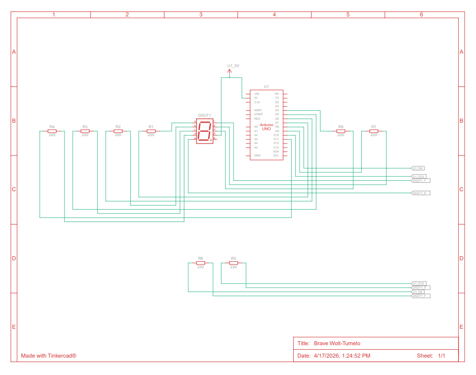

# 📘 Praktikum Sistem Tertanam — Modul 2 Pemrograman GPIO-7 Segment

---

## 📝 Daftar Pertanyaan Praktikum

1. Gambarkan rangkaian skematik yang digunakan pada percobaan!
2. Apa yang akan terjadi apabila nilai `num` melebihi angka 15?
3. Apakah program ini menggunakan _common cathode_ atau _common anode_? Jelaskan alasannya!
4. Modifikasi program agar tampilan berjalan dari **F hingga 0**, dan berikan penjelasan setiap baris kodenya dalam format `README.md`!

---

## ✅ Jawaban

### 1. Skematik Rangkaian



---

### 2. Dampak Nilai `num` yang Melebihi 15

Variabel `num` dalam program ini berfungsi sebagai representasi angka heksadesimal dengan jangkauan valid **0 hingga 15** (setara dengan karakter `0` sampai `F`). Artinya, sistem hanya menyediakan 16 pola tampilan yang telah terdefinisi.

#### Apa yang Terjadi?

Ketika nilai `num` melampaui angka 15, program tidak lagi memiliki referensi pola yang valid di dalam array `digitPattern`. Beberapa konsekuensi yang bisa timbul:

| Kondisi                     | Kemungkinan Hasil                                          |
| --------------------------- | ---------------------------------------------------------- |
| Nilai `num` = 16 atau lebih | Membaca data di luar batas array (_out-of-bounds_)         |
| Tidak ada pembatas nilai    | Tampilan seven segment menampilkan pola acak/tidak terduga |
| Menggunakan modulo (`% 16`) | Nilai akan berputar kembali ke awal secara otomatis        |

> **Kesimpulan:** Nilai `num` wajib dijaga dalam rentang **0 hingga 15** agar tampilan seven segment tetap valid dan terkendali. Penambahan logika pembatas atau _wrap-around_ sangat direkomendasikan.

---

### 3. Jenis Konfigurasi Display: Common Cathode atau Common Anode?

Program ini dirancang untuk seven segment bertipe **Common Cathode**.

#### Dasar Penentuan

Pada display _common cathode_, seluruh kaki katoda dari semua segmen LED disatukan dan dihubungkan ke titik ground (`GND`). Dengan susunan seperti ini, sebuah segmen akan **menyala** apabila pin yang bersangkutan menerima sinyal logika `HIGH`.

#### Bukti dari Kode Program

```cpp
digitalWrite(segmentPin, HIGH); // Segmen menyala
digitalWrite(segmentPin, LOW);  // Segmen padam
```

Penggunaan `HIGH` untuk mengaktifkan segmen secara langsung mencerminkan karakteristik _common cathode_, di mana tegangan positif perlu diberikan ke anoda masing-masing segmen agar arus dapat mengalir menuju katoda yang terhubung ke ground.

#### Perbandingan Singkat

| Aspek        | Common Cathode   | Common Anode     |
| ------------ | ---------------- | ---------------- |
| Titik common | Terhubung ke GND | Terhubung ke VCC |
| Logika nyala | `HIGH`           | `LOW` (dibalik)  |
| Program ini  | ✅ Sesuai        | ❌ Tidak sesuai  |

> **Kesimpulan:** Karena program menggunakan sinyal `HIGH` untuk menyalakan segmen, maka konfigurasi yang digunakan adalah **common cathode**.

---

### 4. Modifikasi Program: Tampilan Mundur dari F ke 0

#### 🎯 Target Perilaku

Program dimodifikasi sehingga seven segment menampilkan urutan karakter heksadesimal secara **menurun**, yaitu dari `F` (nilai 15) hingga `0`, dengan jeda satu detik di setiap pergantian angka. Setelah mencapai `0`, tampilan akan kembali berulang dari `F`.

#### 💻 Kode Program

```cpp
// Pin-pin segmen seven segment (a, b, c, d, e, f, g, dp)
const int segmentPins[8] = {7, 6, 5, 11, 10, 8, 9, 4};

// Pola tampilan untuk angka 0–9 dan huruf A–F
byte digitPattern[16][8] = {
  {1,1,1,1,1,1,0,0},  // 0
  {0,1,1,0,0,0,0,0},  // 1
  {1,1,0,1,1,0,1,0},  // 2
  {1,1,1,1,0,0,1,0},  // 3
  {0,1,1,0,0,1,1,0},  // 4
  {1,0,1,1,0,1,1,0},  // 5
  {1,0,1,1,1,1,1,0},  // 6
  {1,1,1,0,0,0,0,0},  // 7
  {1,1,1,1,1,1,1,0},  // 8
  {1,1,1,1,0,1,1,0},  // 9
  {1,1,1,0,1,1,1,0},  // A
  {0,0,1,1,1,1,1,0},  // B
  {1,0,0,1,1,1,0,0},  // C
  {0,1,1,1,1,0,1,0},  // D
  {1,0,0,1,1,1,1,0},  // E
  {1,0,0,0,1,1,1,0}   // F
};

int num = 15;    // Nilai awal dimulai dari F (15 dalam desimal)

// Fungsi untuk mengirim pola ke seven segment
void tampilkanAngka(int n) {
  for (int i = 0; i < 8; i++) {
    digitalWrite(segmentPins[i], digitPattern[n][i]); // Tulis pola ke setiap segmen
  }
}

void setup() {
  // Daftarkan semua pin segmen sebagai keluaran (OUTPUT)
  for (int i = 0; i < 8; i++) {
    pinMode(segmentPins[i], OUTPUT);
  }

  tampilkanAngka(num);   // Tampilkan nilai awal (F) saat program mulai
}

void loop() {
  tampilkanAngka(num);   // Perbarui tampilan sesuai nilai num saat ini
  delay(1000);           // Tahan tampilan selama 1 detik

  num--;                 // Turunkan nilai satu langkah (decrement)

  if (num < 0) {         // Jika sudah melewati batas bawah (di bawah 0)
    num = 15;            // Kembalikan ke F untuk memulai ulang urutan
  }
}
```

#### 🔍 Penjelasan Baris per Baris

**1. Deklarasi Pin Segmen**

```cpp
const int segmentPins[8] = {7, 6, 5, 11, 10, 8, 9, 4};
```

Mendefinisikan delapan pin Arduino yang terhubung ke segmen-segmen display (a, b, c, d, e, f, g, dan titik desimal). Urutan array ini harus disesuaikan dengan koneksi fisik pada rangkaian.

**2. Array Pola Digit**

```cpp
byte digitPattern[16][8] = { ... };
```

Matriks dua dimensi berisi pola ON/OFF untuk setiap segmen. Baris mewakili nilai yang ditampilkan (0–F), sedangkan kolom mewakili masing-masing segmen. Nilai `1` = menyala, nilai `0` = padam.

**3. Nilai Awal Counter**

```cpp
int num = 15;
```

Menetapkan titik awal perhitungan mundur pada nilai **15**, yang ditampilkan sebagai huruf **F** pada seven segment.

**4. Fungsi `tampilkanAngka()`**

```cpp
void tampilkanAngka(int n) {
  for (int i = 0; i < 8; i++) {
    digitalWrite(segmentPins[i], digitPattern[n][i]);
  }
}
```

Membaca baris ke-`n` dari `digitPattern` dan mengaplikasikan nilainya ke setiap pin segmen secara berurutan, sehingga angka yang sesuai tampil di display.

**5. Inisialisasi di `setup()`**

```cpp
for (int i = 0; i < 8; i++) {
  pinMode(segmentPins[i], OUTPUT);
}
tampilkanAngka(num);
```

Mendaftarkan semua pin sebagai output, lalu langsung menampilkan nilai awal `F` begitu Arduino dinyalakan.

**6. Logika Countdown di `loop()`**

```cpp
tampilkanAngka(num);
delay(1000);
num--;
if (num < 0) { num = 15; }
```

Setiap siklus `loop()` menampilkan nilai saat ini, menunggu 1 detik, lalu mengurangi nilai sebesar 1. Ketika nilai sudah turun ke bawah 0, variabel direset ke 15 agar urutan mundur dimulai lagi dari `F`.

#### 🔁 Urutan Tampilan

```
F → E → D → C → B → A → 9 → 8 → 7 → 6 → 5 → 4 → 3 → 2 → 1 → 0 → F → ...
```

#### 📊 Ringkasan Alur Program

| Langkah           | Aksi         | Nilai `num` |
| ----------------- | ------------ | ----------- |
| Mulai             | Tampil F     | 15          |
| Setelah 1 detik   | Tampil E     | 14          |
| ...               | ...          | ...         |
| Setelah 15 detik  | Tampil 0     | 0           |
| Siklus berikutnya | Kembali ke F | 15          |

> **Kesimpulan:** Modifikasi berhasil membalik arah urutan tampilan menjadi **F → 0** dengan memanfaatkan operasi _decrement_ (`num--`) dan logika _wrap-around_ untuk memastikan program berjalan secara berkesinambungan tanpa batas.

---
